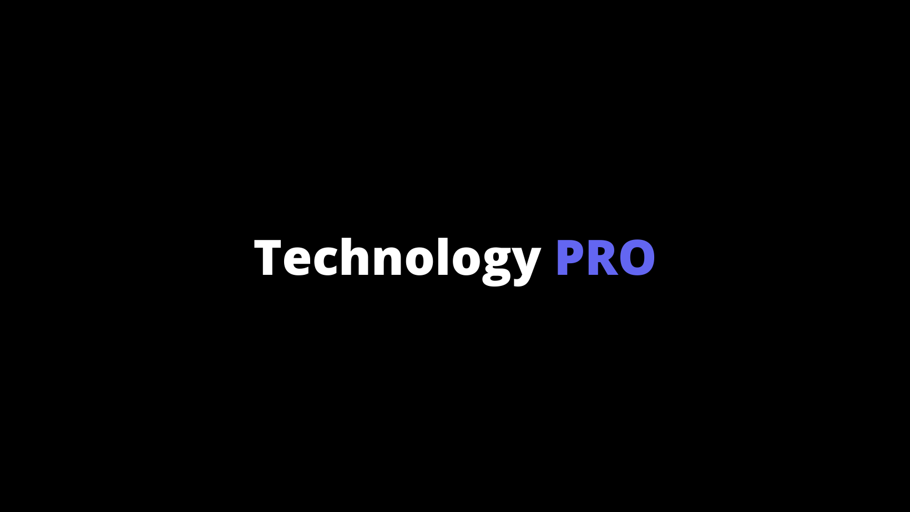

# TechnologyPro App



> A blog application that converts Markdown files into blog posts — a fully featured, mobile‑friendly, responsive web app.

[](https://techpro-app.vercel.app/)
[](https://technologypro.in/)
[](LICENSE)

---

## 📝 Table of Contents

- [TechnologyPro App](#technologypro-app)
  - [📝 Table of Contents](#-table-of-contents)
  - [About the Project](#about-the-project)
  - [🛠 Built With](#-built-with)
  - [Getting Started](#getting-started)
    - [Prerequisites](#prerequisites)
    - [Installation](#installation)
  - [Usage](#usage)
  - [Roadmap](#roadmap)
  - [Contributing](#contributing)
  - [License](#license)
  - [Contact](#contact)

---

##  About the Project

**TechnologyPro App** is designed to simplify the blogging process by converting Markdown files into fully styled, responsive blog posts—powered by Next.js, React, Tailwind CSS, and remark plugins. It delivers a fast and mobile-optimized experience for both readers and content creators. Ideal for developers or content teams who prefer writing in Markdown.

---

## 🛠 Built With

- **Next.js** – React framework for production  
- **React** – UI component library  
- **Tailwind CSS** – Utility-first styling  
- **gray-matter** – Front-matter parser for Markdown  
- **remark** – Markdown processor

---

##  Getting Started

### Prerequisites

Make sure you have the following installed:

```bash
- Node.js (v18+)
- npm or Yarn
```

---

### Installation

1. Clone the repository:
   ```bash
   git clone https://github.com/pagarevijayy/technologypro-app.git
   cd technologypro-app
   ```

2. Install dependencies:
   ```bash
   npm install
   # or
   yarn install
   ```

3. Start the development server:
   ```bash
   npm run dev
   # or
   yarn dev
   ```

4. Open your browser and visit \`http://localhost:3000\` to see the app in action.

---

##  Usage

- **Add a Markdown file** under a designated posts directory (e.g., \`/blog\`) following the naming convention and include front matter.
- The app will **automatically render** your markdown as a blog post using Next.js routing.
- Customize by editing layout, styling, or remark plugin configurations.

---

##  Roadmap

Roadmap is maintained on github issues itself. View issues under `enhancement` tag.

---

##  Contributing

Contributions are welcome! To help improve this project:

1. Fork the repository  
2. Create your feature branch (\`git checkout -b feature/AmazingFeature\`)  
3. Commit your changes (\`git commit -m 'Add some AmazingFeature'\`)  
4. Push to the branch (\`git push origin feature/AmazingFeature\`)  
5. Open a Pull Request

---

##  License

Distributed under the MIT License.

---

##  Contact

Project maintained by [**pagarevijayy**](https://www.vijaypagare.in).  
Site: [technologypro.in](https://technologypro.in)  
GitHub: [@pagarevijayy](https://github.com/pagarevijayy)
